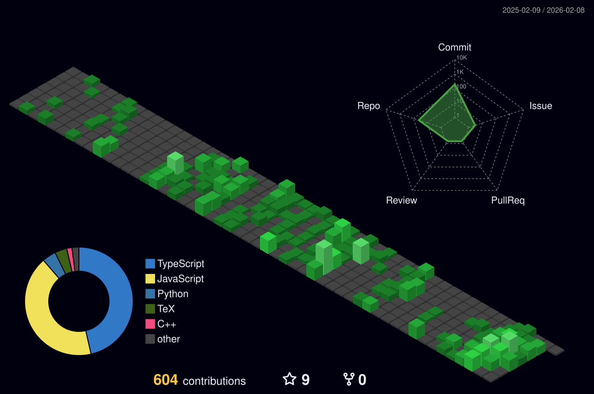

  

  
  
  
  

  
  

 
 🚀 ##About Me

Hi, I'm **Harjot Singh Raith**, an AI and Data Science undergraduate at **NMIMS Navi Mumbai** (CGPA: 3.2/4.0) with strong interests in **AI systems, Large Language Models, qualitative research automation, and intelligent scheduling systems**.

### 🔬 Research Experience

**Research Intern @ IIT Bombay** (eYantra, eRTS Lab) | *June 2025 - Present*
- Developing LLM-based tools for **Thematic Analysis** and multi-format document processing
- Building FastAPI-PostgreSQL backend with automated codex generation and research report summarization
- Designed React-based platform for streamlined qualitative research with visualizations and pattern-recognition

**Research Intern @ IIT Bombay** (eYantra, eRTS Lab) | *May 2024 - July 2024*
- Analyzed large-scale interaction log data for educational platforms using Python, Colab, OCR, ML models
- Identified resource-access patterns, evaluated dwells, and optimized predictive modeling for user behavior
- Developed comprehensive visualizations and pattern-recognition workflows using scaffold analysis techniques

### 📝 Publications

- **Video Analysis and OCR Techniques for Collaborative Problem-Solving** (May 2024 - Dec 2024)
- **YTubeRAG: Leveraging YouTube Content for Enhanced LLM Training** (Nov 2024 - May 2025)
- **AI-Driven Timetable Generation and Optimization Based Scheduling** *(Accepted, Jan 2025 - Nov 2025)*

### 🏆 Achievements

- 🥇 **Judges' Choice Award** - eYIC 2023-24 Finals, IIT Bombay (503 teams)
- 🥈 **2nd Place** - VOIS International Hackathon 2024 (India, Romania, Egypt)
- 🏅 **8 Wins** across 20+ national & international hackathons
- 👨‍💼 **Head of Robotics Club** - NMIMS Navi Mumbai (July 2024 - Present)

 

---

## 💼 Featured Projects

### 🔴 [LiveWire](https://github.com/Harjotraith04/LiveWire) - Real-time Code Compiler *(AWS Global Vibe)*
Built a real-time code-compiler platform using **Monaco, WebSockets, and Gemini AI**. Developed app-sharing with **Socket.IO, Express.js, MongoDB**. Tech: **CodeMirror, Clerk, Vercel, Railway**.

### 🤖 [ArgoMind AI](https://github.com/Harjotraith04/ArgoMind-AI) - Dashboard & Mapbot *(SIIT'25)*
Automated ship targeting system with sequential schema, real-time dashboards, and RAG system using **Argo data with ML-driven ocean disaster predictions**. Tech: **Flask, React, FastAPI, Docker, Gemini API**.

### 📅 TimeTableAI & Almanac AI - Timetable Generation *(Capstone Project)*
Created a full-stack timetable optimization platform with **RAG** for quick retrieval using **LLMs, FastAPI, MongoDB, Docker, Lodash.js, React, Vite, TailwindCSS, MUI, Axios, Node.js, Express.js, MongoDB, Gemini AI, Vercel, Render**.

### 🐍 Blaze: Bio-Inspired Robotic Snake *(Gujarat Robofest'25)*
Created autonomous robotic snake using **CNNs, kinematics, and LiDAR** for detection in confined spaces. Tools: **ESP32, OpenCV, Motor Modules, VL53L0X, LIDAR Sensors, OpenCV, Inverse Kinematics**.

---

## 💻 Technical Skills

**Languages:** Python • CUDA • Shell • LaTeX • C • C++ • Java • SQL • JavaScript • TypeScript

**Dev Tools:** Linux • AWS • GCP • Docker • Kubernetes • Hugging Face • Wandb • Overfeat • GitHub

**Frameworks:** TensorFlow • PyTorch • FastAPI • Flask • OpenCV • Langchain • Streamlit • Keras • Selenium

---

## 🛠️ Tech Stack

  

---

## 📊 GitHub Statistics

  
  

  

---

## 🏆 GitHub Trophies

  

---

## 📈 Contribution Activity

  

---

## 🐍 Contribution Snake

  

---

## 📅 3D Contribution Calendar

  

---

### 💡 Random Dev Quote

### 📫 Let's Connect!

**Open to research collaborations, internships, and impactful AI projects**

Feel free to reach out: [harjots.raith@gmail.com](mailto:harjots.raith@gmail.com)

---

  

